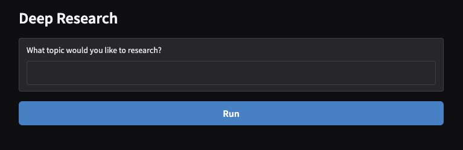

# Deep Research Tool

A sophisticated AI-powered research automation tool that performs comprehensive web research, generates detailed reports, and delivers results via email. Built with OpenAI's agent framework and Gradio for a user-friendly interface.



## 🚀 Features

- **Intelligent Research Planning**: AI agent plans optimal search strategies for any research query
- **Automated Web Search**: Performs multiple concurrent web searches using OpenAI's WebSearchTool
- **Comprehensive Report Generation**: Creates detailed 5-10 page research reports in markdown format
- **Email Delivery**: Automatically sends formatted HTML reports via SendGrid
- **Real-time Progress Tracking**: Streams research progress updates in real-time
- **Modern Web Interface**: Clean, responsive Gradio-based UI

## 🏗️ Architecture

The Deep Research tool uses a multi-agent architecture:

- **Planner Agent**: Strategizes research approach and determines search queries
- **Search Agent**: Executes web searches and summarizes findings
- **Writer Agent**: Synthesizes research into comprehensive reports
- **Email Agent**: Formats and delivers reports via email
- **Research Manager**: Orchestrates the entire research workflow

## 📋 Prerequisites

- macOS (tested on macOS 24.3.0)
- Python 3.12.6
- OpenAI API key
- SendGrid API key (for email functionality)

## 🛠️ Installation

### 1. Install pyenv and pyenv-virtualenv

#### Install pyenv using Homebrew:
```bash
brew install pyenv
```

#### Add pyenv to your shell configuration:
```bash
# Add to ~/.zshrc (for zsh)
echo 'export PYENV_ROOT="$HOME/.pyenv"' >> ~/.zshrc
echo 'command -v pyenv >/dev/null || export PATH="$PYENV_ROOT/bin:$PATH"' >> ~/.zshrc
echo 'eval "$(pyenv init -)"' >> ~/.zshrc

# Reload your shell
source ~/.zshrc
```

#### Install pyenv-virtualenv:
```bash
brew install pyenv-virtualenv
```

#### Add pyenv-virtualenv to your shell configuration:
```bash
# Add to ~/.zshrc
echo 'eval "$(pyenv virtualenv-init -)"' >> ~/.zshrc

# Reload your shell
source ~/.zshrc
```

### 2. Install Python 3.12.6 and Create Virtual Environment

```bash
# Install Python 3.12.6
pyenv install 3.12.6

# Create a new virtual environment called 'learning'
pyenv virtualenv 3.12.6 learning

# Navigate to your project directory
cd /Projects/Code/Deep_Research

# Set the local Python version to use the 'learning' virtual environment
pyenv local learning

# Verify the Python version
python --version  # Should show Python 3.12.6
```

### 3. Install Dependencies

```bash
# Activate the virtual environment (if not already active)
pyenv activate learning

# Install required packages
pip install -r requirements.txt
```

### 4. Environment Configuration

Create a `.env` file in your project root:

```bash
# OpenAI API Configuration
OPENAI_API_KEY=your_openai_api_key_here

# SendGrid Configuration
SENDGRID_API_KEY=your_sendgrid_api_key_here
```

**Note**: Update the email addresses in `email_agent.py` with your verified SendGrid sender and recipient emails.

## 🚀 Usage

### Starting the Application

```bash
# Ensure you're in the virtual environment
pyenv activate learning

# Run the Deep Research tool
python deep_research.py
```

The application will launch in your default browser at `http://localhost:7860`.

### Using the Interface

1. **Enter Research Query**: Type your research topic in the text box
2. **Click Run**: Start the research process
3. **Monitor Progress**: Watch real-time updates as the tool:
   - Plans research strategy
   - Performs web searches
   - Generates comprehensive report
   - Sends email notification
4. **View Results**: The final report will be displayed in the interface

## 🔧 Configuration

### Customizing Search Parameters

- Modify `HOW_MANY_SEARCHES` in `planner_agent.py` to change the number of web searches performed
- Adjust search context size in `search_agent.py` for different levels of search detail

### Report Customization

- Modify the `INSTRUCTIONS` in `writer_agent.py` to change report length and style
- Adjust the `ReportData` model to include additional report fields

### Email Settings

- Update sender and recipient emails in `email_agent.py`
- Modify email formatting instructions for different presentation styles

## 📁 Project Structure

```
Deep_Research/
├── deep_research.py          # Main application entry point
├── research_manager.py       # Core research orchestration logic
├── search_agent.py          # Web search execution agent
├── planner_agent.py         # Research strategy planning agent
├── writer_agent.py          # Report generation agent
├── email_agent.py           # Email delivery agent
├── requirements.txt          # Python dependencies
└── README.md                # This file
```

## 🔍 How It Works

1. **Query Input**: User submits a research topic
2. **Research Planning**: Planner agent analyzes the query and determines optimal search strategy
3. **Web Search Execution**: Search agent performs multiple concurrent web searches
4. **Content Synthesis**: Writer agent analyzes search results and generates comprehensive report
5. **Email Delivery**: Email agent formats and sends the final report
6. **Progress Streaming**: Real-time updates are provided throughout the process

## 🚨 Troubleshooting

### Common Issues

**pyenv not found**: Ensure you've added pyenv to your PATH and reloaded your shell
**Virtual environment not activating**: Check that pyenv-virtualenv is properly installed and configured
**OpenAI API errors**: Verify your API key is correct and has sufficient credits
**SendGrid errors**: Ensure your SendGrid API key is valid and sender email is verified

### Debug Mode

The application provides trace IDs for debugging. Check the console output for trace URLs that can be viewed in the OpenAI platform.

## 🤝 Contributing

This is a research tool designed for personal use. Feel free to fork and modify for your own research needs.

## 📄 License

This project is for educational and research purposes.

## 🔗 Dependencies

- **gradio**: Modern web interface framework
- **openai**: OpenAI API client and agent framework
- **openai-agents**: Agent orchestration tools
- **python-dotenv**: Environment variable management
- **sendgrid**: Email delivery service
- **pydantic**: Data validation and serialization

## 📞 Support

For issues related to:
- **pyenv/pyenv-virtualenv**: Check the [pyenv documentation](https://github.com/pyenv/pyenv)
- **OpenAI Agents**: Refer to [OpenAI's agent documentation](https://platform.openai.com/docs/agents)
- **SendGrid**: Visit [SendGrid's support](https://support.sendgrid.com/)

---

**Happy Researching! 🧠📚**
